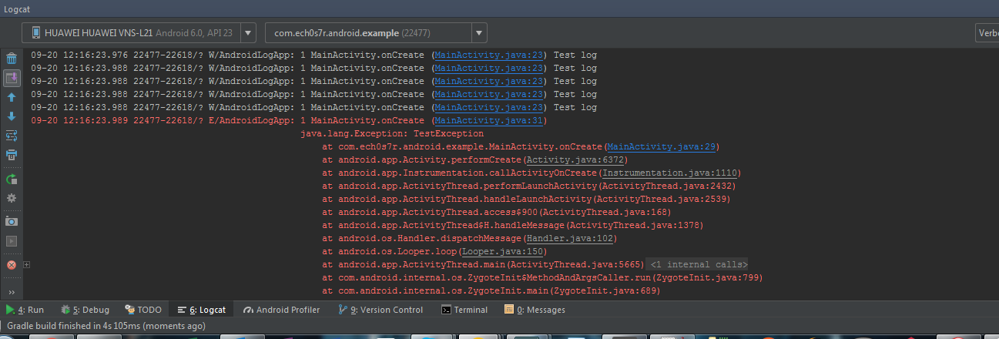
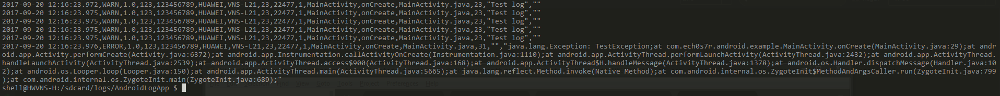

# Android Logger Library
[](https://travis-ci.com/ech0s7r/androidlog)
[  ](https://bintray.com/ech0s7r/Android-Lib/androidlog/1.2.8/link)

Logger library created for simple integration of logger capability to android applications providing APIs to write logs with different level of verbosity and avoiding to write boilerplate code like declaring TAG for each class or use static functions to get the logger instance every time as implemented in the most logger library on the market. This library makes the logger process simple to use, pretty and powerful. 

The library is distributed as Android Studio project named *loggerlib* that depends on the module *lintrules*.

The order in terms of verbosity, from the least to the most is: ASSERT, ERROR, WARN, INFO, DEBUG and VERBOSE. Verbose and Debug should never be used in production. Assert should be used only to log error that should never happens (eg. App crash).  


### Features

- Minimum performance impact
- Logcat integration
- Log file writing
- File rotation
- CSV format output
- Editable current timestamp
- Crash system detection
- Compile time correctness detection
- Log level supports
- String format args
- Customizable *Layout* and *Appenders*

The library is fully thread-safe, it creates a separate process for the logger and communicate with it over AIDL, each library function returns immediately to the caller and the file writing process is managed in a separate process with a MIN PRIORITY daemon thread. 


### Download

Repository available on jCenter

```
implementation 'com.ech0s7r.android:loggerlib:1.2.8@aar'
```

If the dependency fails to resolve, add this to your project repositories 

```
repositories {
    maven {
        url  "https://dl.bintray.com/ech0s7r/Android-Lib"
    }
}
```

[Find me on Bintray](https://bintray.com/ech0s7r/Android-Lib/androidlog)


### *[Optional] Enable text report*

If you wish to enable the text report, add the following in your app module build.gradle:

```groovy
lintOptions {
    textReport true
    textOutput 'stdout'
}
```
<!--checkReleaseBuilds true
    abortOnError true
    ignoreWarnings true
    check 'AndroidLogDetector', 'SystemOutDetector', 'PrintStackTraceDetector', 'NoLoggedException', 'MissingSuperCall'
    fatal 'AndroidLogDetector', 'SystemOutDetector', 'PrintStackTraceDetector', 'NoLoggedException', 'MissingSuperCall'
    htmlOutput file("$project.buildDir/reports/lint/lint-result.html")
    htmlReport true
-->

### Setting up

1. Import *loggerlib* module into the project

2. Initialize the logger using the LoggerConfigurator class 

   ```java
   LoggerConfigurator.init(
         Logger.Level.WARN,        /* Minimum level to log */
         123,                      /* Application ID */
         "MyApp",                  /* Application name */
         BuildConfig.VERSION_NAME, /* Application version */
         getDeviceId(),            /* Device ID */
         "MyAppAndroid.log");      /* File name prefix */
   ```

3. Add *Layouts* with *Appenders*

   ```java
   LoggerConfigurator.addAppender(new LogcatAppender(new LogcatLayout()));
   LoggerConfigurator.addAppender(new FileAppender(getApplicationContext(), new CsvLayout()));
   ```

   The supported appenders, for now, are writing on Logcat and writing on File with Csv layout and Logcat layout.


### How to use

The Logger usage is pretty simple, all that you need is to call the right static method from the Logger class, as following:

##### Verbose

```java
Logger.v("verbose");
```
##### Debug
```java
Logger.d("debug");
```

##### Info
```java
Logger.i("info");
```

##### Warning
```java
Logger.w("warning");
```

##### Error
```java
Logger.e("error");
```

##### Wtf
```java
Logger.wtf("What a Terrible Failure");
```

##### String format arguments are supported
```java
Logger.w("Hello %s %d", "world", 1);
```

##### How to log Exceptions
```java
try {
    ...
} catch (Exception e){
   Logger.e(e);
   // or
   Logger.e("description", e);
}
```


### Compilation time check (Lint integration)

The library implements 4 kinds of custom Lint rules to avoid common error and promote the usage of this library instead of the android built-in logger library. These rules are checked at compile time and if not respected an error will be generated during the build process. The Lint scanning tools, in case of build error, generate an HTML file that can be controlled to see where the following rules are not observed.

- ##### SystemOutDetector

  All the usages of the System.out.print/ln() or System.err.print/ln() are forbidden.

- ##### PrintStackTraceDetector

  The usage of Throwable.printStackTrace() is forbidden, see How to log Exception.

- ##### AndroidLogDetector

  The usage of android.utils.Log is forbidden

- ##### NoLoggedException

  Every Exception should be logged


### Customization

New *Appenders* and *Layout*s can be added by developers, extending the *LogAppender* and *LogLayout* classes. 

New Lint rules are more than welcome and can be added in the *lintrules* module.


### Ouptut

##### Logcat



Each line logged on Android logcat contains the following elements:

1. Date and Time
2. Process ID
3. App package
4. Log level
5. Thread ID
6. Class.Method (File name : code line)
7. Message

##### File

The log files are stored into the sd-card in a new directory with the same name of the application, into the folder “logs”. The file name is generated adding the current date (format yyyyMMdd) to file prefix used during the logger configuration.

*Example:*
If the application name is MyApp and the file prefix is MyAppAndroid.log, the generated files are: 

> ​	…
>
> ​	/sdcard/logs/MyApp/MyAppAndroid.log20170803
>
> ​	/sdcard/logs/MyApp/MyAppAndroid.log20170804
>
> ​	…	




<!--
##### **The CSV layout used is the following:**

Each line has same number of elements comma separated, following elements are now supported and logged:

1. Timestamp (in the format yyyy-MM-dd hh:MM:ss.SSS)
2. Log level (String)
3. App version (String)
4. Company ID (Integer)
5. Device code (String) 
6. Device Manufacturer (String)
7. Device Board (String)
8. SDK Version (Integer)
9. Process ID (Integer)
10. Thread ID (Integer)
11. Class name (String)
12. Method name (String)
13. File name (String)
14. Line number (Integer)
15. Description(String)
16. Stack Trace (String, optional) 
-->